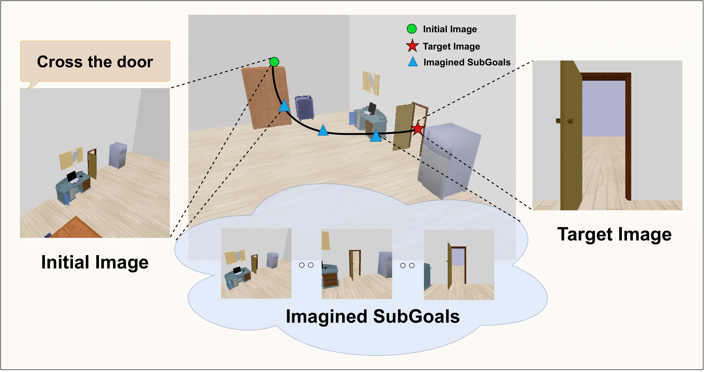

# Imagine2Servo: Intelligent Visual Servoing with Diffusion-Driven Goal Generation for Robotic Tasks

[Pranjali Pathre](https://github.com/pranjali-pathre/), [Gunjan Gupta](https://github.com/Gunjanph/), [M. Nomaan Quresh](https://github.com/qureshinomaan/), [Mandyam Brunda](https://github.com/brunda02), [Samarth Brahmbhatt](https://github.com/samarth-robo) and [K. Madhava Krishna](http://robotics.iiit.ac.in)

This repository contains the code for training image-editing diffusion model on demonstrations. For implementing servoing controller, head over to the [RTVS](https://github.com/VedanshM/RTVS) repository. 

<p align="center">
    
</p>

## Installation

We recommend setting up a Python 3.10.13 Virtual Environment and installing all the dependencies listed in the requirements file. 

```
git clone https: https://github.com/pranjali-pathre/Imagine2Servo

cd Imagine2Servo
pip install -r requirements.txt
```
